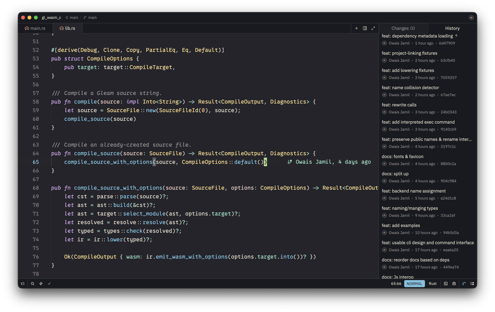
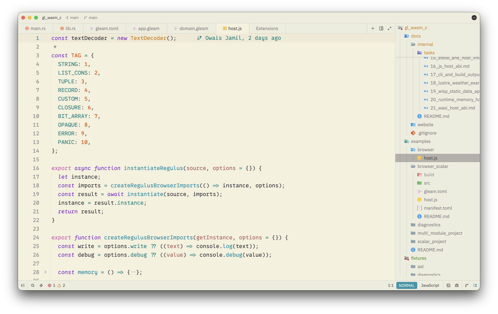

# Ecto Cooler for Zed

Zed theme extension for Ecto Cooler, an experimental color palette that blends Gruvbox
with Catppuccin:

- **Ecto Cooler Dark**: Gruvbox dark + Catppuccin **Mocha**
- **Ecto Cooler Light**: Gruvbox light + Catppuccin **Latte**

The theme keeps Gruvbox's warm, earthy readability while using Catppuccin **sapphire**
as the primary UI accent. The rest of the Catppuccin pastels are used for syntax contrast,
diagnostics, terminal colors, and editor chrome.

## Screenshots

| Dark                                       | Light                                      |
| ------------------------------------------ | ------------------------------------------ |
|  |  |

## Usage

In Zed, install this directory as a development extension:

1. Open the command palette.
2. Run **zed: install dev extension**.
3. Select this directory.
4. Choose either **Ecto Cooler Dark** or **Ecto Cooler Light** from the theme picker.

## Palette source

This palette blends the color palettes of the Catppuccin & Gruvbox vim themes.

### Generated Ecto Cooler palettes

| Token          | Gruvbox Dark + Mocha | Gruvbox Light + Latte |
| -------------- | -------------------- | --------------------- |
| `bg`           | `#24242b`            | `#f5f1dc`             |
| `bg_alt`       | `#26252a`            | `#ede7d1`             |
| `bg_float`     | `#36353e`            | `#e9e2d1`             |
| `bg_sidebar`   | `#181a1f`            | `#ededde`             |
| `bg_visual`    | `#58656a`            | `#c7c2b9`             |
| `bg_search`    | `#f9d686`            | `#ce8419`             |
| `bg_incsearch` | `#fba66a`            | `#e35608`             |
| `bg_selection` | `#696f6f`            | `#b4afab`             |
| `fg`           | `#e0d9cb`            | `#414047`             |
| `fg_alt`       | `#c9c3bd`            | `#555259`             |
| `fg_muted`     | `#928e91`            | `#847e81`             |
| `fg_subtle`    | `#7c787e`            | `#979293`             |
| `red`          | `#f57e91`            | `#c50b2d`             |
| `maroon`       | `#ef8d92`            | `#d3333f`             |
| `orange`       | `#fba76d`            | `#e85809`             |
| `yellow`       | `#f9d88b`            | `#d0851a`             |
| `green`        | `#aada86`            | `#509423`             |
| `aqua`         | `#93dbc1`            | `#228c88`             |
| `sky`          | `#8ad7d7`            | `#109dc9`             |
| `sapphire`     | `#76c2e0`            | `#1c96ab`             |
| `blue`         | `#88b1e6`            | `#1966da`             |
| `purple`       | `#cca0e6`            | `#8a3ad3`             |
| `pink`         | `#eeb6d8`            | `#d66ab7`             |
| `rosewater`    | `#edd9ce`            | `#b5786a`             |
| `flamingo`     | `#ebcbc2`            | `#b66b6a`             |
| `lavender`     | `#aab9ea`            | `#5a80e0`             |
